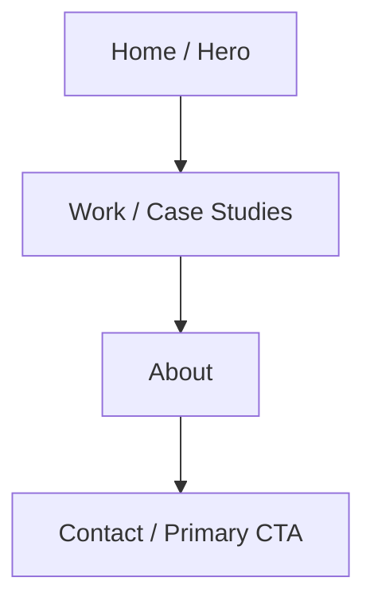

# Portfolio Sitemap

## Proof Statement

"I am a Python developer who builds reliable applications, REST APIs, and backend systems, and my portfolio should prove my ability to solve real-world business problems through clean, scalable software."

## Target Audience

This portfolio is targeted specifically at recruiters, hiring managers, and potential employers looking for a Python developer who can deliver dependable backend services, APIs, and software solutions.

## Primary Action

Contact me for a development opportunity.

## Sitemap

```text
Home
├── Hero
├── Work / Case Studies
├── About
└── Contact
```

## Visual Sitemap



## Visitor Journey

The visitor journey is intentionally linear, focused, and frictionless:

1. **LANDING** — The visitor arrives on the single-page portfolio with zero navigation clutter.
2. **UNDERSTANDING WHO I AM** — The Hero section establishes clear Python developer positioning and the core proof statement immediately above the fold.
3. **SEEING PROOF / WORK** — The Work / Case Studies section delivers concrete technical evidence: reliable backend architectures, clean REST APIs, and practical business problem-solving.
4. **BUILDING TRUST** — The About section reinforces technical competency, engineering values, and dedication to clean, maintainable Python code.
5. **TAKING ONE CLEAR ACTION** — The visitor reaches a prominent, focused call-to-action without conflicting secondary links.
6. **CONTACT ME** — The Contact section offers direct, accessible channels to initiate conversations for development opportunities.

## Why Each Section Exists

Every section in this minimal sitemap directly earns its place against the proof statement, audience, and primary action:

* **Hero:** Quickly answers "Who is this developer and what do they build?" for recruiters scanning candidates in seconds.
* **Work / Case Studies:** Provides undeniable proof of Python capability, REST API design, and real-world problem-solving.
* **About:** Establishes engineering credibility, professional approach, and backend development principles.
* **Contact:** Directly facilitates the primary portfolio objective — getting in touch for a Python development opportunity.
